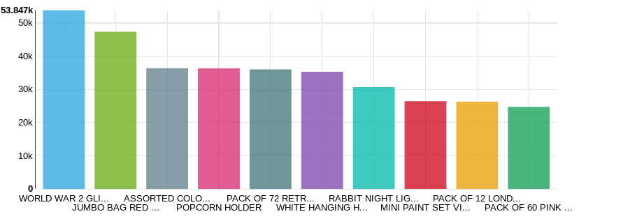
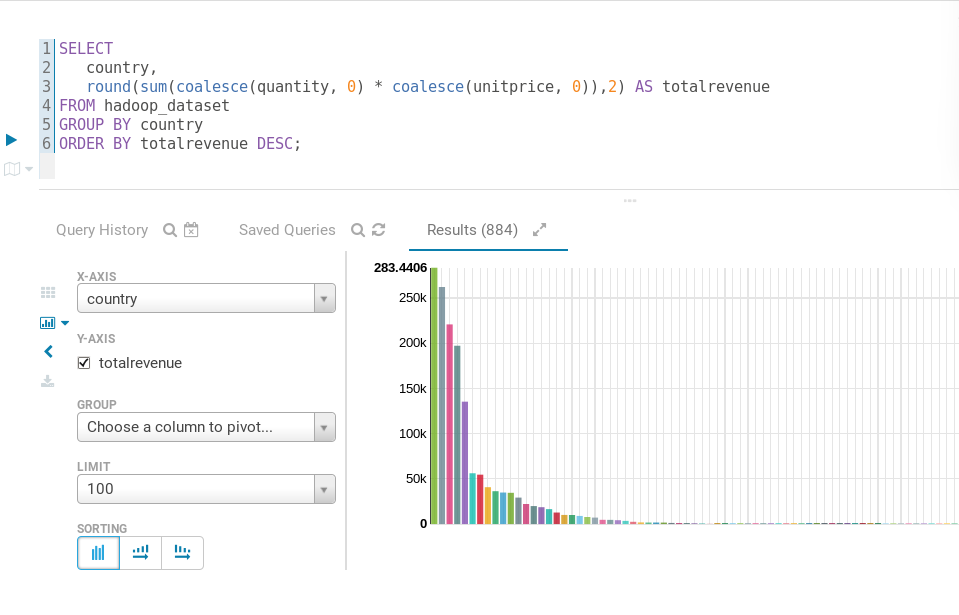
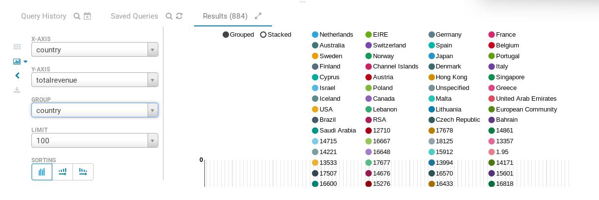
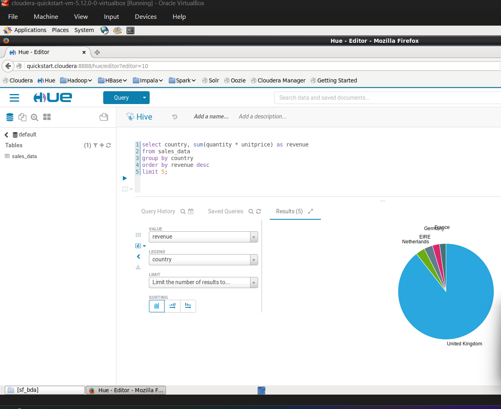

# 📊 E-Commerce Product Analysis using Hadoop

## Overview
The **E-Commerce Product Analysis** project aims to process and analyze large scales of retail data to extract meaningful business insights and trends. By utilizing the robust Hadoop ecosystem, this project solves the problem of handling massive datasets that traditional relational databases struggle with. It empowers data-driven decision-making by revealing sales trends, identifying top-performing products, and analyzing customer purchasing behaviors.

---
## 📸 Project Screenshots

### 1. Country-wise Total Sales Revenue Analysis


### 2. Sales Revenue Distribution Visualization


### 3. Hive Query Results – Country Revenue Aggregation


### 4. Hive Query Execution in Apache Hive Interface


---
## 🏗️ Architecture / Workflow
The data pipeline and workflow are designed for high scalability and efficient querying:

**Dataset** ➡️ **HDFS (Storage)** ➡️ **Hive (Data Warehousing)** ➡️ **Query Analysis** ➡️ **Dashboard/Insights**

1. The raw e-commerce dataset is ingested into the Hadoop Distributed File System (HDFS).
2. A schema is applied on read using Apache Hive, creating a structured table over the raw data.
3. Complex HiveQL queries are executed to perform aggregations, filtering, and analysis.
4. The output insights are exported for further visualization and reporting.

---

## 🛠️ Technologies Used
- **Hadoop**: Core framework for distributed storage and processing.
- **HDFS**: Hadoop Distributed File System for storing massive datasets.
- **Hive**: Data warehouse infrastructure for querying and analyzing data.
- **HiveQL**: SQL-like declarative language for data manipulation.
- **Cloudera QuickStart VM**: Virtualized environment providing a complete Hadoop ecosystem.
- **Big Data ecosystem tools**: To handle data ingestion and execution flows.

---

## 🗂️ Dataset
The analysis uses a comprehensive e-commerce dataset (`hadoop_dataset.csv`) comprising historical sales data. It logs transactional records, including:
- `InvoiceNo`: Unique identifier for each transaction.
- `StockCode`: Product item code.
- `Description`: Product name.
- `Quantity`: Number of items purchased.
- `InvoiceDate`: Timestamp of the transaction.
- `UnitPrice`: Cost per item.
- `CustomerID`: Unique customer identifier.
- `Country`: Region where the transaction occurred.

This dataset provides the foundational data used to discover patterns such as top-selling products and revenue distribution.

---

## 🚀 Project Workflow

### 1. Loading Dataset to HDFS
The raw `hadoop_dataset.csv` file is uploaded into a designated HDFS directory to establish centralized, distributed storage using Hadoop shell commands (`hdfs dfs -put`).

### 2. Creating Hive Table
Using HiveQL, an external/internal table mapped to the HDFS dataset directory is created. The schema is strictly defined to match the CSV structure:
```sql
CREATE TABLE IF NOT EXISTS sales_data (
    InvoiceNo STRING,
    StockCode STRING,
    ...
)
ROW FORMAT DELIMITED
FIELDS TERMINATED BY ','
STORED AS TEXTFILE;
```

### 3. Running HiveQL Queries
Various HiveQL scripts are executed to compute aggregations, such as grouping sales by product description or country, and sorting items by total quantity sold or generated revenue.

### 4. Extracting Insights
The results of the executed queries are evaluated to draw actionable business insights, such as identifying the "Top 10 Most Sold Products."

---

## 📂 Repository Structure
```text
📦 E-Commerce-Product-Analysis
 ┣ 📜 hadoop_dataset.csv     # The raw dataset used for analysis
 ┣ 📜 hive_table_code.sql    # HiveQL script to create the Hive table and run queries
 ┣ 📜 README.md              # Project documentation
 ┗ 📂 screenshots/           # Contains screenshots of the Hadoop and Hive workflow
```

---

## 🧠 Key Learnings
Through the successful execution of this project, several core competencies were developed:
- **Hadoop Architecture**: Deepened understanding of distributed storage, NameNodes, and DataNodes.
- **HiveQL Queries**: Mastered syntax for creating tables, loading data, and running complex analytical queries on big data.
- **Big Data Storage in HDFS**: Learned optimized strategies for loading and handling large flat files in a distributed file system.
- **Data Analysis on Large Datasets**: Gained hands-on experience in converting raw data into meaningful business intelligence at scale.

---

## 🔮 Future Improvements
To further enhance the project's analytical capabilities, the following additions are considered:
- **Spark Integration**: Process data using Apache Spark for faster, in-memory computation compared to traditional MapReduce.
- **Power BI Dashboard**: Connect the exported insights to Power BI or Tableau to generate an interactive, real-time visual dashboard.
- **Real-time Analytics**: Introduce Kafka and Spark Streaming to process live e-commerce transactions as they happen.
